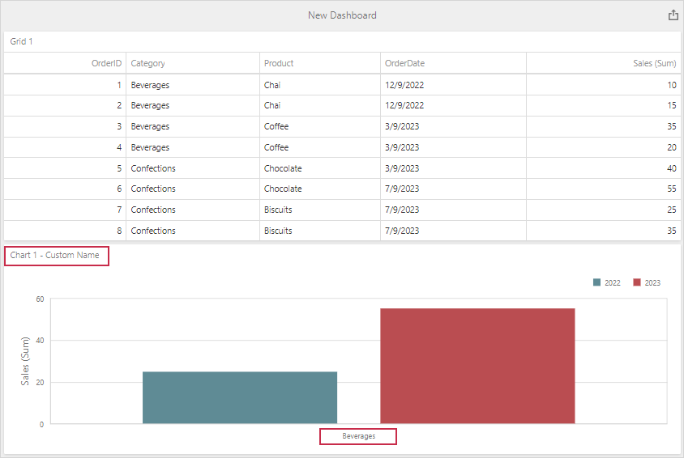

<!-- default badges list -->

<!-- default badges end -->
# Dashboard for MVC - How to Customize the Default Settings of the Newly Added Items

This example demonstrates how to subscribe to the [dashboard.items](https://docs.devexpress.com/Dashboard/js-DevExpress.Dashboard.Model.Dashboard#js_devexpress_dashboard_model_dashboard_items) collection changes to track when new items are added or existing items are removed. This allows you to change the default item configuration with the [Dashboard Model API](https://docs.devexpress.com/Dashboard/402482/web-dashboard/ui-elements-and-customization/dashboard-model).

This example applies the following settings to the dashboard items:

* Adds custom name for the newly added items.
* Limits chart's display data.
* Invokes a notification dialog when you remove the existing item.

The image below shows the added chart item with the custom "Chart 1 - Custom Name" caption that displays sales of Beverages category only.

## Files to Look at

* [Index.cshtml](./CS/Views//Home/Index.cshtml)

## Documentation

- [Client-Side API Overview for ASP.NET MVC Dashboard](https://docs.devexpress.com/Dashboard/16796/web-dashboard/aspnet-mvc-dashboard-extension/client-side-api-overview)
- [Providing Data](https://docs.devexpress.com/Dashboard/117297/web-dashboard/create-dashboards-on-the-web/dashboard-item-settings/grid/providing-data)

## More Examples

- [Dashboard for MVC - Get Started](https://github.com/DevExpress-Examples/web-dashboard-asp-net-mvc-application)
